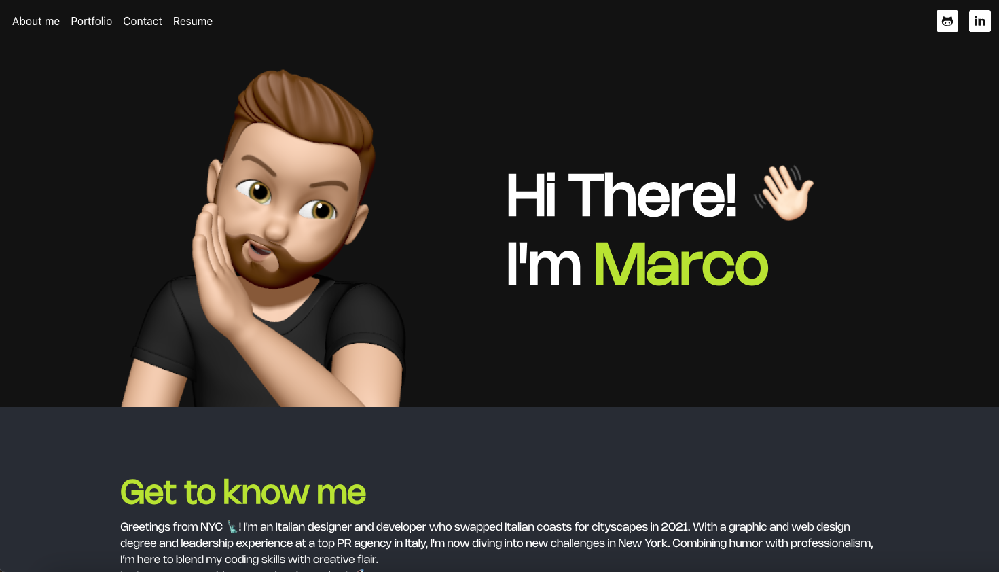
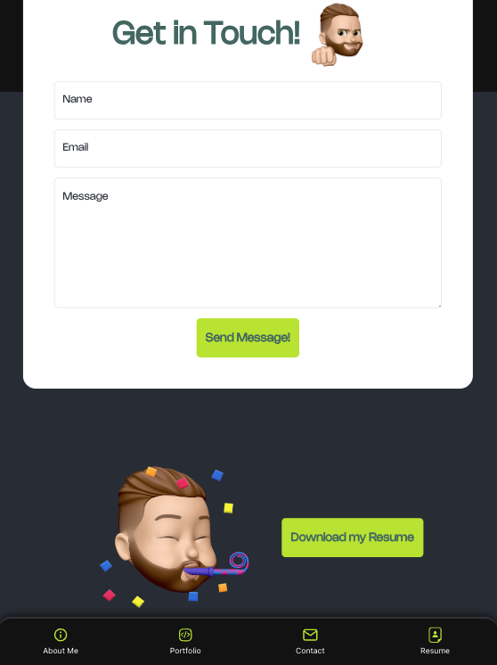
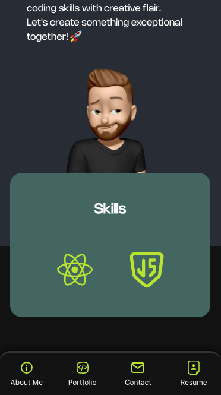

# Marco React Portfolio

## Description
Marco React Portfolio is a personal website designed to showcase creative projects and technical skills in web development. The site is built using a modern web technology stack that emphasizes responsive design and interactive user experiences. This portfolio not only highlights my work but also demonstrates my capabilities in utilizing various web technologies.

### Key Features:

1. **Responsive Design:** Utilizes CSS frameworks combined with custom media queries to ensure the website is accessible and functional on all devices.
2. **Dynamic Content:** Features interactive elements such as modals, carousels, and AJAX-driven content loading to engage visitors.
3. **Portfolio Showcase:** Categorized display of projects, complete with detailed case studies, image galleries, and direct links to live sites or GitHub repositories.
4. **Contact Form:** A fully functional contact form, enhanced with backend technologies, provides an easy way for visitors to connect.

## Table of Contents
- [Usage](#usage)
- [Mockup](#mockup)
- [Technologies Used](#technologies-used)
- [Credits](#credits)
- [License](#license)
- [Questions](#questions)

## Usage
To view Marco Portfolio, visit [this link](https://marco-react-portfolio-0d23f28e396e.herokuapp.com/).

## Mockup
The following image shows the layout of the web application:

## Technologies Used
- **HTML5 & CSS3**: For structuring and styling the website.
- **JavaScript (ES6+)**: For creating dynamic and interactive user experiences.
- **React**: Utilized for its component-based architecture, facilitating the modular design of the website.
- **Bootstrap**: For responsive design elements that adapt to different screen sizes and devices.
- **Node.js and Express**: For backend server implementation.
- **Heroku**: For deploying the application and managing the live environment.
- **Git**: For version control and source code management.
- **GitHub**: For hosting the repository and facilitating collaboration.

## Credits
- [Bootstrap](https://getbootstrap.com)
- [React](https://reactjs.org/)
- [Node.js](https://nodejs.org/)
- [MongoDB](https://www.mongodb.com/)
- [Heroku](https://www.heroku.com/)
- [shields.io](https://shields.io/)

## License
This project is licensed under the [MIT](https://opensource.org/licenses/MIT) license.

## Questions
For any questions, please reach out via:
- GitHub: [marphco](https://github.com/marphco)
- Email: [marphco@gmail.com](mailto:marphco@gmail.com)
